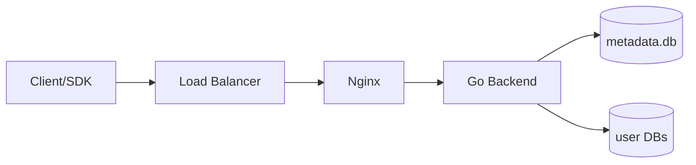
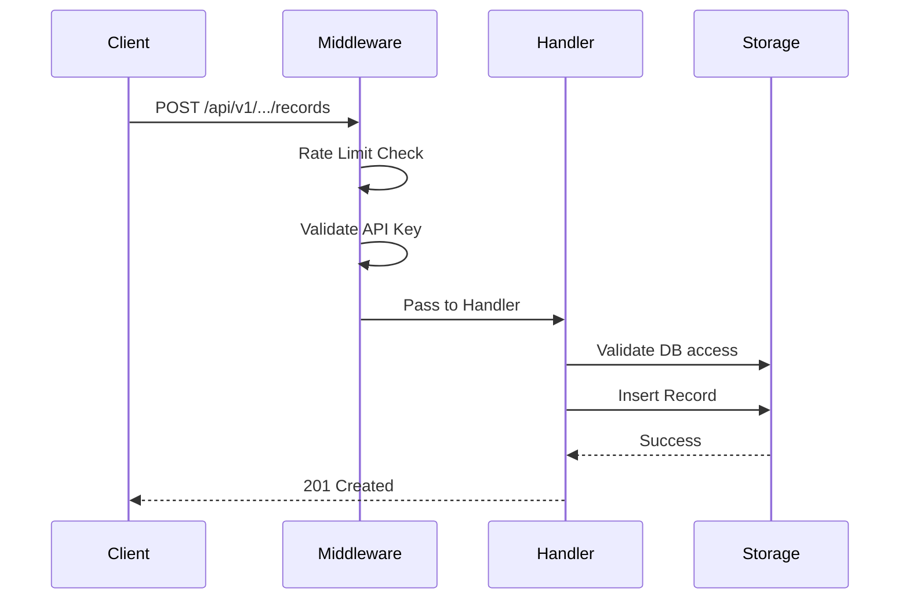

# Architecture Overview

Nebula follows a **layered architecture** with clear separation of concerns, designed for containerized deployment with Kubernetes.

## High-Level Flow



## Directory Structure

```
nebula-backend/
├── cmd/server/          # Application entry point
├── config/              # Configuration loading
├── api/                 # API Layer (Gin)
│   ├── handlers/        # HTTP request handlers
│   ├── middleware/      # Auth, CORS, rate limiting
│   ├── models/          # Request/Response DTOs
│   └── router.go        # Route definitions
├── internal/            # Core business logic
│   ├── auth/            # JWT & password utilities
│   ├── core/            # Shared utilities
│   ├── domain/          # Business entities
│   ├── logger/          # Structured logging
│   └── storage/         # Database operations
└── data/                # SQLite databases (runtime)
```

## Component Layers

<AccordionGroup>
  <Accordion title="API Layer" icon="server">
    **Location:** `api/`
    
    Handles HTTP concerns using the Gin framework:
    - **Handlers:** Parse requests, call business logic, format responses
    - **Middleware:** Authentication, rate limiting, CORS, error handling
    - **Models:** DTOs for request/response serialization
    - **Router:** Maps endpoints to handlers
  </Accordion>
  
  <Accordion title="Internal Layer" icon="gear">
    **Location:** `internal/`
    
    Framework-agnostic core logic:
    - **Auth:** JWT generation/validation, password hashing
    - **Storage:** Database operations (metadata + user DBs)
    - **Domain:** Core business entities (User, etc.)
    - **Logger:** Structured logging implementation
  </Accordion>
  
  <Accordion title="Storage Layer" icon="database">
    **Location:** `internal/storage/`
    
    Data persistence using SQLite:
    - **metadata.db:** Central database for users, database mappings, API keys
    - **User DBs:** Isolated SQLite files per user (`data/<user_id>/<db_name>.db`)
  </Accordion>
</AccordionGroup>

## Request Flow Example

Create a record using an API key:



## Data Storage

<CardGroup cols={2}>
  <Card title="Metadata Database" icon="database">
    `data/metadata.db` stores:
    - User accounts
    - Database registrations
    - API key hashes
  </Card>
  <Card title="User Databases" icon="folder">
    `data/<user_id>/<db_name>.db`:
    - Isolated per user
    - Custom schemas
    - User data records
  </Card>
</CardGroup>

### Concurrency

- **WAL Mode** enabled for better read/write concurrency
- **Busy timeout** configured to handle lock contention
- Different user databases can be written to concurrently

<Warning>
  SQLite has single-writer limitations. For high-throughput production workloads, consider migrating to PostgreSQL or MySQL.
</Warning>

## Deployment

Nebula is designed for containerized deployment:

| Component | Purpose |
|-----------|---------|
| Docker | Build application image |
| Kubernetes | Orchestrate containers |
| PersistentVolume | Store SQLite files across restarts |
| Ingress | Route external traffic |
| ConfigMap/Secret | Manage configuration |
